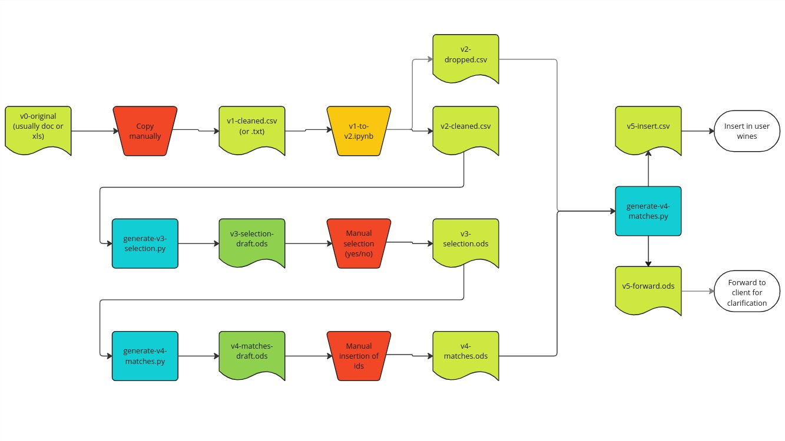

# Vinoteqa Onboarding Process

This repository has been created to smoothly on-board a new user on the Vinoteqa platform, stress-free and even when you're drunk :)

## Table of contents

- [Getting started](#getting-started)
- [Pipeline Overview](#pipeline-overview)
- [Usage](#usage)
- [Appendix](#appendix)
- [Support](#support)

## Getting Started

To get you started with onboarding new clients, and get you up to speed with all the necessary tools, follow the steps below:

### Python Modules

The necessary Python modules to make the onboarding work are in `requirements.txt`.

It is highly recommended to use virtual environments, in order not to pollute your system Python installation.
To do this, you can use either `venv` or `conda`.

#### Create virtual environments with venv

 - Create a local `venv` virtual environment:

```bash
python3 -m venv venv
```
This will create a folder called `venv` in your working directory.

*Note*: If `venv` is not installed on your local machine, you can install it using your system package manager.

 - Activate the virtual environment:

```bash
source venv/bin/activate
```

*Note*: when you start a new VS Code bash session, the virtual environment is activated automatically

 - Install the required Python modules:

```bash
pip install -r requirements.txt
```

**IMPORTANT**:
 - make **absolutely sure** to run this command within your virtual environment only,
otherwise the packages will be installed on your system Python installation,
which is not recommended.

To exit from the virtual environment, run:

```bash
deactivate
```

If you wish to *completely* delete the virtual environment, just delete the `venv` folder.

#### Create virtual environments with conda

As an alternative, you can use `conda` to manage your virtual environments
You can check the [docs](https://conda.io/projects/conda/en/latest/user-guide/tasks/manage-environments.html) for how to do it.

## Pipeline Overview

The onboarding is a semi-automatized process, where a matching algorithm tries to match the wines provided by the client with the wines in our database. Some manual data cleaning and checks are necessary.



This table provides an overview of the purpose and formatting of all the intermediate files. More details can be found below.

| Name                     | Description                                                                |
| ------------------------ | -------------------------------------------------------------------------- |
| `v0-original`            | Raw input file from the client. Usually DOCX or XLSX.                      |
| `v1-start`               | input file in TXT or CSV format.                                           |
| `v2-cleaned.csv`         | Input File with formatted headers and content. Used to find matches in DB. |
| `v2-dropped.csv`         | Wines where formatting is too messy. Will be a tab in `v5-forward.ods`     |
| `v3-selection-draft.ods` | Wines matched with the DB, matches must be manually checked.               |
| `v3-selection.ods`       | Manual check of the matches done.                                          |
| `v4-matches-draft.ods`   | Wines that were matches wrongly, where IDs must be inserted manually.      |
| `v4-matches.ods`         | Wines with where all the matches manually checked and IDs added.           |
| `v5-insert.csv`          | File formatted for insertion.                                              |
| `v5-forward.ods`         | Wines where IDs were not found, to forward to the client                   |

## Usage

Make sure to **always** execute the `git pull` command before each new onboarding:

1. Switch to the `main` branch and `git pull` to ensure that you are up-to-date with the latest changes:

```bash
git checkout main
git pull
  ```

2. Create a dedicated branch for the onboarding of **each** client. Execute the following command to create and switch to this branch:

```bash
git checkout -b onboarding/<CLIENT_NAME>
```

**IMPORTANT**:

 - Commit your changes to `onboarding/<CLIENT_NAME>` after completing each of the subsequent steps.
 - Merge `onboarding/<CLIENT_NAME>` into `main` only **after** you have finished all the steps. Please refer to [Merging Procedure](#merging-procedure) for further details.


### v0-original: Beginning of the onboarding
This is the original file provided by the client.

 - Create the onboarding folder `onboardings/<CLIENT NAME>`.
 - Put the file provided by the client in the onboarding folder, name it `v0-original` and keep the file extension unchanged.
 - There might be multiple files from the client. In that case, name them `v0-original-1.&`, `v0-original-2` etc.
 - Commit and push to remote:

```bash
git add onboardings/<CLIENT_NAME>/v0-original*
git commit -m "v0: start <CLIENT_NAME> onboarding"
git push --set-upstream origin onboarding/<CLIENT_NAME>
```

### v1-start.csv (.txt): true input file
This file contains the contents of `v0-original`, but in a more machine-friendly format.

 - Create `v1-start`:
   - if `v0-original` is a spreadsheet (`.xlsx`, `.ods` etc.), `v1-start` should be a `.csv` file;
   - if `v0-original` is a document (`.docx`, `.odt` etc.), `v1-start` should be a `.txt` file;
   - if there are multiple `v0-original` files, create also multiple `v1-start` files and name them accordingly.
 - Copy the contents of `v0-original` in `v1-start`.
 - Perform some manual cleanup of `v1-start` if deemed necessary.
 - Commit your changes

```bash
git add onboardings/<CLIENT_NAME>/v1-start*
git commit -m "v1: add v1-start"
git push
```

**IMPORTANT**:
 - It might happen that you need to modify `v1-start` while processing it in the next step. In case this happens, commit the changes as you do them:

```bash
git add onboardings/<CLIENT_NAME>/v1-start*
git commit -m "v1: cleanup v1-start"
git push
```

### v2-cleaned.csv
This is the file that will be given as input to the matching algorithm, so it must have a standard format.

 - Create a notebook in the onboarding folder, and name it `v1-to-v2.ipynb`. The final output of this notebook should be `v2-cleaned.csv`.
   - Only a single file `v2-cleaned.csv` must exist.
 - Perform all the necessary preprocessing in this notebook.
   - More details about the necessary fields in the [Appendix](#appendix).
   - You can use the class `VColumns` in the `utils` module to get the necessary columns.
 - Commit and push to remote:

```bash
git add onboardings/<CLIENT_NAME>/v2-cleaned.csv
git commit -m "v2: add v2-cleaned.csv"
git push
```

**IMPORTANT**:

 - No null values should be present. For removing null values, use `fill_empty` from `utils`.
 - If it is not possible to separate `name` and `winery_name`, leave `winery_name` empty and put everything in `name`.

**VERY IMPORTANT!!:**
 - `price` and `purchase_price` are in **cents**, **NOT IN EUR!!**


### v3-selection.ods
This file contains the wines matched by the matching algorithm. Some matches need to be checked manually.

 - Run the matching script to generate the draft file `v3-selection-draft.ods`

```bash
python generate-v3-selection.py <CLIENT_NAME>
```

 - Commit your changes

```bash
git add onboardings/<CLIENT_NAME>/v3-selection-draft.ods
git commit -m "v3: add v3-selection-draft.ods"
git push
```

 - Create a copy of the draft file, and name it `v3-selection.ods`.
 - Manually review the matches in the sheet `AUTO (select correct)`:
   - put a 1 in the field `ok` if the match is correct, otherwise leave it empty or write 0.
 - Commit and push to remote:

```bash
git add onboardings/<CLIENT_NAME>/v3-selection.ods
git commit -m "v3: add v3-selection.ods"
git push
```

### v4-matching.ods
This file contains the wines that were marked as not correct in the previous step, as well as the wines that were not matched with any wine in the database.

 - Run the script to generate the draft file `v4-matches-draft.ods`

```bash
python generate-v4-matches.py <CLIENT_NAME>
```

- Commit and push to remote:

```bash
git add onboardings/<CLIENT_NAME>/v4-matches-draft.ods
git commit -m "v4: add v4-matches-draft.ods"
git push
```

 - Create a copy of the draft file, and name it `v4-matches.ods`.
 - Manually insert `matched_id` in the sheet `Manual (insert id)`:
   - to find the ID, search the wine in the admin portal and copy its ID;
   - if the wine is not present at all in the database, add it manually. Perform the search again and copy its ID;
   - if the wine that needs to be matched is unclear, leave `matched_id` empty.
 - Commit and push to remote:

```bash
git add onboardings/<CLIENT_NAME>/v4-matches.ods
git commit -m "v4: add v4-matches.ods"
git push
```


### v5-insert.csv and v5-forward.ods
 - Run the script to generate the draft files `v5-insert-draft.csv` and `v5-forward-draft.ods`:

```bash
python generate-v5-insert.py <CLIENT_NAME>
```

- Commit and push to remote:

```bash
git add onboardings/<CLIENT_NAME>/v5-insert-draft.csv
git add onboardings/<CLIENT_NAME>/v5-forward-draft.ods
git commit -m "v5: add v5-insert-draft.ods and v5-forward-draft.ods"
```

 - Copy the files and remove `"draft"` from their name:
   - they should be fine as they are. If not, perform the necessary manual changes.
 - Commit and push to remote:

```bash
git add onboardings/<CLIENT_NAME>/v5-insert.csv
git add onboardings/<CLIENT_NAME>/v5-forward.ods
git commit -m "v5: add v5-insert.ods and v5-forward.ods"
```

 - Upload `v5-insert.csv` in the onboarding portal.
 - Send `v5-forward.csv` to the client for clarification.


### Merging Procedure
After you completed all the steps, the onboarding branch is ready to be merged into `main`. We do a squashed merge commit, in order not clutter `main` with commits of intermediate steps.

#### Get up-to-date with remote
 - Make sure to be up-to-date with all changes on both `main` and `onboarding/<CLIENT_NAME>`:
   1. checkout `main` and git pull;
   2. do the same for `onboarding/<CLIENT_NAME>`:

```bash
git checkout main
git pull
git checkout onboarding/<CLIENT_NAME>
git pull
```

**IMPORTANT**:
  - Do these steps **exactly** in the order specified here, in order to be checked out on `onboarding/<CLIENT_NAME>`.

#### Solve merge conflicts
 - Merge `main` into `onboarding/<CLIENT_NAME>` and solve possible merge conflicts:

```bash
git merge main
```

 - Run `v1-to-v2.ipynb` and all the scripts `generate-v*.py` again, to make sure nothing broke in the merge:
   - if something broke, make sure to correct the errors.

#### Merge into `main`

 - Checkout to `main`:

```bash
git checkout main
```

 - Merge squash `main` with `onboarding/<CLIENT_NAME>`:

```bash
git merge --squash onboarding/<CLIENT_NAME>
```

 - Edit the commit message as follows:

```txt
onboarding: <CLIENT_NAME>
```

 - Push to remote:

```bash
git push
```

#### Archive onboarding branch
The old onboarding branch is now stale, and no longer needs to be used. For future bookkeeping, we archive it instead of deleting it.

 - Checkout again to `onboarding/<CLIENT_NAME>`:

```bash
git checkout onboarding/<CLIENT_NAME>
```

 - Tag the commit pointed by `onboarding/<CLIENT_NAME>` and push to remote:

```bash
git tag archive/onboarding/<CLIENT_NAME>
git checkout archive/onboarding/<CLIENT_NAME>
git push origin tag archive/onboarding/<CLIENT_NAME>
```

 - Delete `onboarding/<CLIENT_NAME>` locally and on remote:

```bash
git branch -d onboarding/<CLIENT_NAME>
git push origin -d onboarding/<CLIENT_NAME>
```

 - Checkout `main`:

```bash
git checkout main
```

**Congratulations! The onboarding procedure is now complete.**


## Appendix
### Details for v2-cleaned.csv
#### Fields

| Field name       | dtype | meaning                            |
| ---------------- | ----- | ---------------------------------- |
| `external_id`    | `str` | unique ID to easily identify wines |
| `type`           | `str` | wine type (RED, WHITE etc.)        |
| `name`           | `str` | name of the wine                   |
| `winery_name`    | `str` | name of the winery                 |
| `info`           | `str` | extra information                  |
| `size`           | `str` | bottle format                      |
| `vintage`        | `int` | vintage year                       |
| `price`          | `int` | price in **cents**                 |
| `purchase_price` | `int` | purchase price in **cents**        |
| `quantity`       | `int` | number of bottles present          |
| `storage_area`   | `str` | storage area of the wines          |
| `internal_notes` | `str` | internal notes for the wine        |

The field names are returned by `utils.VColumns.v2()`.

The possible values of the fields `type` and `size` are returned by `vvalues.Type.get()` and `vvalues.Size.get()` in the `vvalues` module from `utils`:

```python
from utils import vvalues
```


#### Field: `type`
The `type` field should always be filled. Most onboarding sheets provided by the customers are divided by type.
This makes it easy to add the type manually.

To obtain the possible values of `type`:

```python
possible_types = vvalues.Type.get()
```

Which returns:

```python
[
  "RED",
  "WHITE",
  "SPARKLING",
  "ROSE",
  "DESSERT"
]
```

#### Field: `size`
Like before, the `size` field should always be filled. The usual wine bottle is 0.75 liters.

To obtain the possible values of `size`:

```python
possible_sizes = vvalues.Size.get()
```

Which returns:

```python
[
  "HALF_BOTTLE"
  "HALF_LITER"
  "BOTTLE"
  "LITER"
  "MAGNUM"
  "JEROBOAM"
  "REHOBOAM"
  "BORDEAUX_JEROBOAM"
  "MATHUSALEM"
  "IMPERIAL"
  "SALMANAZAR"
  "BALTHAZAR"
  "NEBUCHADNEZZAR"
  "MELCHIOR"
  "SOLOMON"
  "SOVEREIGN"
  "GOLIATH"
  "MELCHIZEDEK"
]
```

To get the mapping from size in liters to size name:

```python
size_to_name = vvalues.Size.get_mapping()
size_to_name_alternative = vvalues.Size.get_mapping_alternative()
```

Where in the alternative mapping the 6l bottle is called `IMPERIAL` instead of `MATHUSALEM`.

### Support

For support, please contact [vinoteqa@gmail.com](mailto:vinoteqa@gmail.com).
