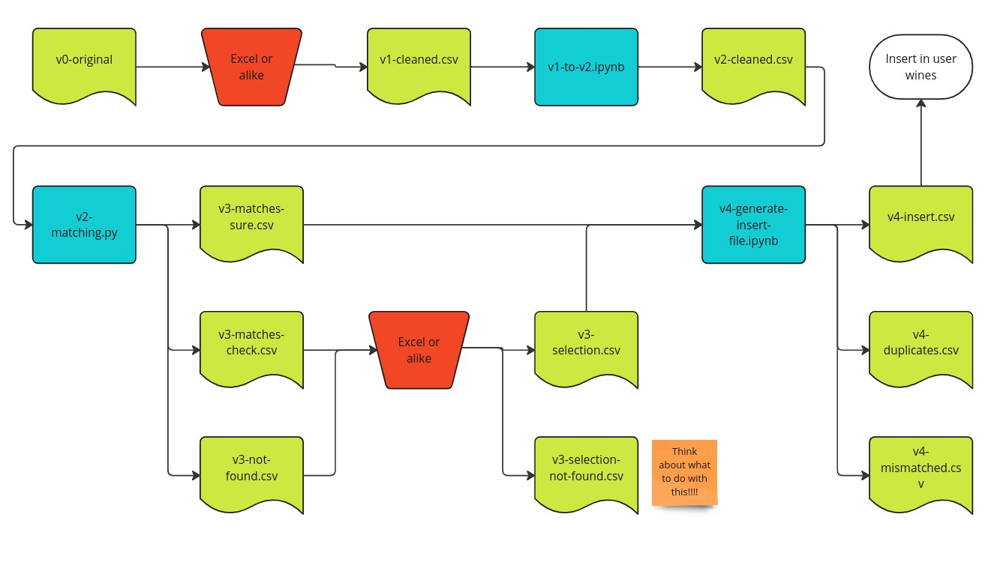

# Onboarding procedure

## Pipeline
The onboarding phase follows this pipeline:


## Intermediate files

### Overview
This table provides an overview of the purpose and formatting of the documents of each onboarding.

| Name                         | Description                                                                    | Purpose   |
| ---------------------------- | ------------------------------------------------------------------------------ | --------- |
| `v0-original`                | Raw input file from the client.                                                | input     |
| `v1-cleaned.csv`             | Input file with formatted headers.                                             | input     |
| `v2-dropped.csv`             | Input File with formatted headers and content. Used to add wines manually.     | input     |
| `v2-cleaned.csv`             | Input File with formatted headers and content. Used to find matches in DB.     | input     |
| `v3-matches-sure.csv`        | Wines matched automatically with the DB. No further check.                     | matches   |
| `v3-matches-check.csv`       | Wines matched automatically with the DB. Manual check needed.                  | matches   |
| `v3-not-found.csv`           | Wines not successfully matched automatically with the DB. Manual check needed. | matches   |
| `v3-selection.csv`           | Wines matched manually with the DB.                                            | matches   |
| `v3-selection-not-found.csv` | Wines not successfully matched manually.                                       | matches   |
| `v4-insert.csv`              | Wines to be inserted in `user_wines`.                                          | insertion |

## Content description
This section gives an overview on the formatting standards for headers and contents of the intermediate files.

### v1
The file `v1-cleaned.csv` has the same contents as `v0-original`. The difference is in the fields, which must be renamed according to the standard specified in `v2`.

Missing fields are ignored.

It might be the case that 2 original fields must be joined in order to be mapped to one of the standard fields. In that case, fields get the suffixes `_one`, `_two` etc.


### v2
Contents must be formatted so that these types are respected:
| Field name       | dtype   |
| ---------------- | ------- |
| `external_id`    | `float` |
| `name`           | `str`   |
| `winery_name`    | `str`   |
| `type`           | `str`   |
| `storage_area`   | `str`   |
| `size`           | `str`   |
| `vintage`        | `int`   |
| `price`          | `float` |
| `info`           | `str`   |
| `quantity`       | `int`   |
| `internal_notes` | `str`   |

The `size` field has only some allowed values. The standard mapping is this:

```python
{
    '0.375': 'HALF_BOTTLE',
    '0.5': 'HALF_LITER',
    '0.75': 'BOTTLE',
    '1': 'LITER',
    '1.5': 'MAGNUM',
    '3': 'JEROBOAM',
    '4.5': 'REHOBOAM',
    '5': 'BORDEAUX_JEROBOAM',
    '6': 'MATHUSALEM',
    '9': 'SALMANAZAR',
    '12': 'BALTHAZAR',
    '15': 'NEBUCHADNEZZAR',
    '18': 'MELCHIOR',
    '20': 'SOLOMON',
    '25': 'SOVEREIGN',
    '27': 'GOLIATH',
    '30': 'MELCHIZEDEK'
}
```
Where the key is the bottle size in liters.

### v3
These files are generated after the automatic matching. In addition to the fields in `v2`, these are added:

| Field name            | dtype   |
| --------------------- | ------- |
| `matched_id`          | `str`   |
| `matched_name`        | `str`   |
| `matched_winery_name` | `str`   |
| `matched_original_id` | `str`   |
| `score`               | `float` |

#### v3-selection
The `v3-selection-*` files have also this field added:
| Field name | dtype  |
| ---------- | ------ |
| `ok`       | `bool` |

Which says whether the match is correct or not.


### v4
These files only have these fields:

| Field name       | dtype   |
| ---------------- | ------- |
| `wine_id`        | `str`   |
| `external_id`    | `float` |
| `size`           | `float` |
| `vintage`        | `int`   |
| `price`          | `float` |
| `info`           | `str`   |
| `storage_area`   | `str`   |
| `quantity`       | `int`   |
| `internal_notes` | `str`   |


## Note for older onboardings
The onbarding procedure was not clearly defined yet for these restaurants:
 - damichele
 - dolomiti-lodge-alvera
 - laite
 - mondschein
 - pfoesl
 - vinessa

Therefore, the onboarding there does not exactly follow the procedure described above.
A major difference is that `v3-matches-sure.csv` is not used. Instead, only `v3-matches-check.csv` is, which is therefore called `v3-matches.csv`.
