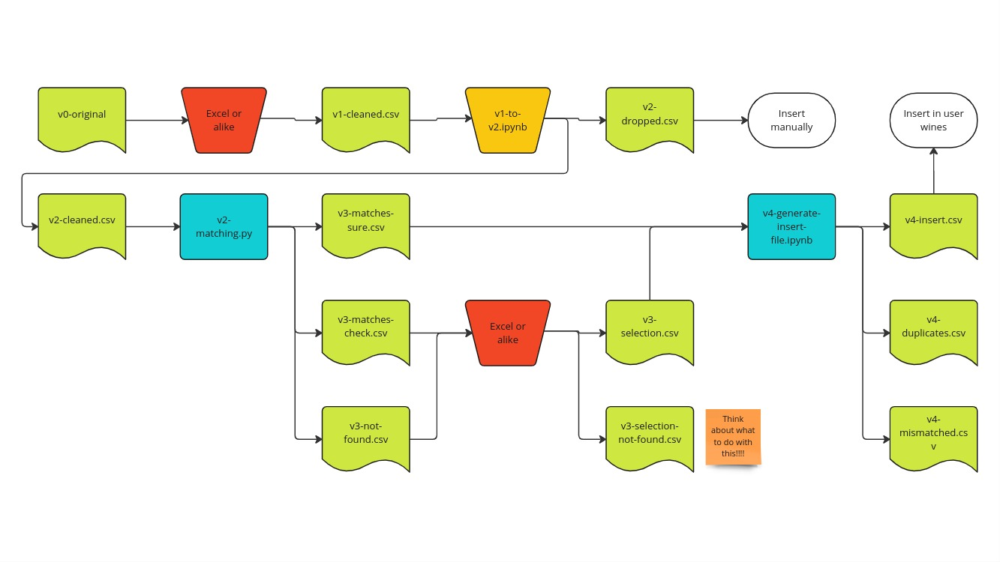

# Onboarding procedure

The onboarding phase follows this pipeline:

The documents are described here:

| Name                         | Description                                                                    | Header format | Content format | Split/extra/missing fields |
| ---------------------------- | ------------------------------------------------------------------------------ | ------------- | -------------- | -------------------------- |
| `v0-original`                | Raw input file from the client.                                                | raw           | raw            | yes                        |
| `v1-cleaned.csv`             | Input file with formatted headers.                                             | input         | raw            | yes                        |
| `v2-cleaned.csv`             | Input File with formatted headers and content. Used to find matches in DB.     | input         | input          | no                         |
| `v3-matches-sure.csv`        | Wines matched automatically with the DB. No further check.                     | matches       | matches        | no                         |
| `v3-matches-check.csv`       | Wines matched automatically with the DB. Manual check needed.                  | matches       | matches        | no                         |
| `v3-not-found.csv`           | Wines not successfully matched automatically with the DB. Manual check needed. | matches       | matches        | no                         |
| `v3-selection.csv`           | Wines matched manually with the DB.                                            | matches       | matches        | no                         |
| `v3-selection-not-found.csv` | Wines not successfully matched manually.                                       | matches       | matches        | no                         |
| `v4-insert.csv`              | Wines to be inserted in `user_wines`.                                          | insert        | insert         | no                         |

Note: the initial restaurants do not have `v3-matches-sure.csv`. Instead, they only use `v3-matches-check.csv`, which is called `v3-matches.csv`. These are:
 - damichele
 - dolomiti-lodge-alvera
 - laite
 - mondschein
 - pfoesl
 - vinessa

In addition, the onbarding procedure for these restaurants was not clearly defined yet, so some other things might have been different.
